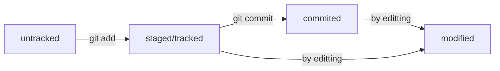

**Welcome to Git Helper!**
==========================
Here are a few steps to initialize your repo and to connect local and remote repo`s:
------------------------------------------------------------------------------------
* git init - local repo initialization
* git add --all - choose saving files
* git commit -m "comment" - save files patch
* git branch -M main - create main branch
* ssh-keygen -t ed25519 -C "git-mail" - to create ssh-keys (if you don`t have keys) and add public key to your github-profile
* git remote add origin "git@gitaddr" - connect local and remote repo`s
* git push -u origin main - relocate local files to remote repo

Git files states:

